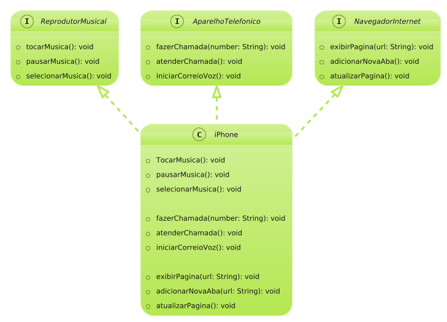

# DESAFIO - Modelando o iPhone com UML: Funções de Músicas, Chamadas e Internet

- Entrega do projeto desafio iPhone com UML colocando em prática o aprendizado de concepção de análise de negócios, seus requisitos, conceitos da programação orientada a objetos e modelagem UML.
- Foi elaborado na ferramenta PlantUML a diagramação das classes e interfaces com a proposta de representar os papéis do iPhone de: Reprodutor Musical, Aparelho Telefônico e Navegador na Internet. 
- Foi criado o projeto no Intellij IDEA os projeto utilizando as classes e interfaces, mencionado no diagrama, assim como a itulização dos metodos.

 

